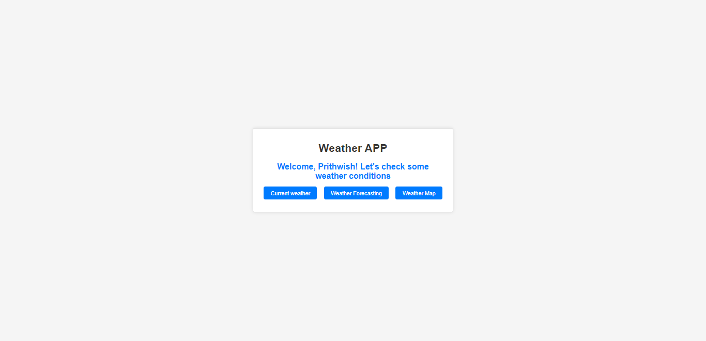
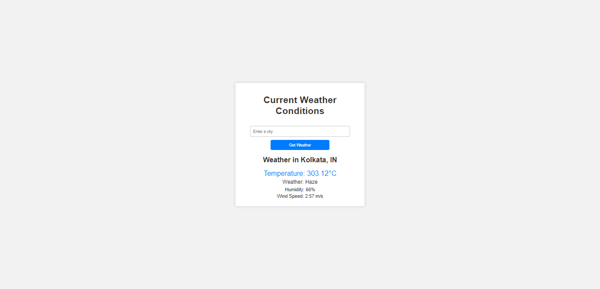

# Django Weather App

This Django-based web application provides real-time weather information and satellite maps based on city names using the Weatherbit.io API. It allows users to enter a city name and view a satellite map of the selected location.

## UI Snaps

## Features

- Get real-time weather information.
- View satellite maps based on city names.

## Installation
Clone this repository:

     
     git clone https://github.com/your-username/django-weather-app.git
Navigate to the project directory:

   
      cd django-weather-app
Create a virtual environment:

    
      python -m venv venv
Activate the virtual environment:

On Windows:

   
      venv\Scripts\activate
On macOS and Linux:

      source venv/bin/activate
Install the project dependencies:

    
      pip install -r requirements.txt
Run the development server:

   
      python manage.py runserver
Access the app in your web browser at http://localhost:8000.

## Usage
Enter a city name in the input form.
Click the respective button.
View the information of the selected location.
Weather App Satellite Map

## Acknowledgments
Windy and open weathermap for providing the weather data and maps.
Django for the web framework.
Feel free to customize this README with additional information, usage instructions, or any other details relevant to your specific app. You can add more screenshots, modify the layout, and provide any necessary documentation to help users understand and use your application effectively.
